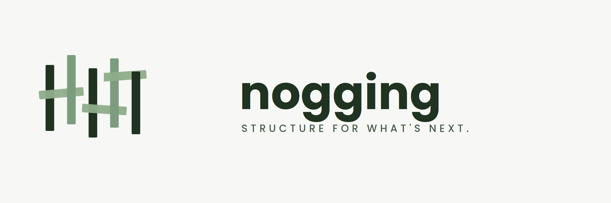
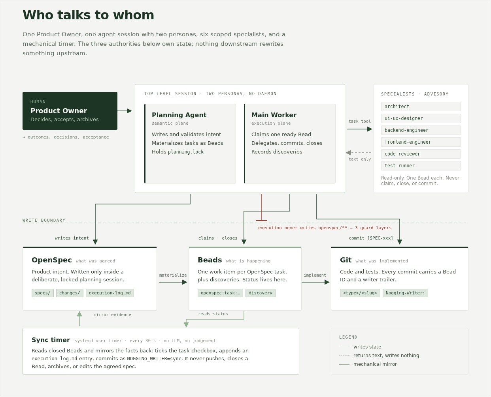
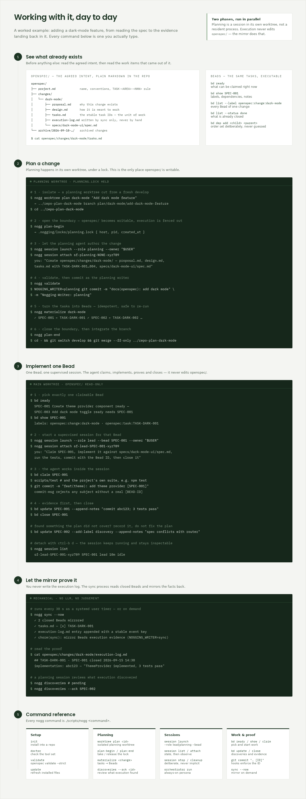

# Nogging

**Structure for what's next.**

Nogging is a lean, local-first operating model for agentic software delivery.
It gives product intent, executable tasks, and implementation evidence clear
owners so autonomous agents can move quickly without quietly changing the
plan. The command and installed state are named `nogg`.
OpenSpec owns approved product intent, Beads owns executable work, and Git owns
the implementation. A deterministic sync process mirrors execution evidence
back into OpenSpec; it never makes product decisions.

## Project status and audience

Nogging is a **pre-public release candidate**. Its core workflow and Linux
installation path are exercised in CI, but public-release acceptance is still
in progress. Keep the repository private and avoid production-critical,
unattended use until the signed acceptance report and final readiness report
are complete.

Nogging is for teams and maintainers who want autonomous coding agents to work
from approved specifications with durable task ownership and auditable Git
evidence. It is not an agent runtime, hosted service, or replacement for your
existing Git repository, OpenSpec installation, or Beads tracker.

## Supported environments

- **Platform:** Linux is the supported host. Bash, Git, Python, Node.js,
  OpenSpec, Beads, and Dolt are required for the complete workflow.
- **Agents:** payloads and guidance are included for Claude Code, Codex, and
  Pi. Their permission and sandbox guarantees differ.
- **Optional host features:** systemd provides background sync and tmux
  provides supervised sessions. Use `--no-systemd` when neither is wanted.
- **Other systems:** macOS, Windows, other service managers, and unlisted agent
  versions are not currently claimed as supported.


See the [compatibility policy and matrix](docs/compatibility.md) for minimum
versions, supported combinations, and evidence. `./scripts/nogg doctor` checks
the current machine against the required tool set.

## The two phases

1. **Planning:** a Product Owner and Planning Agent create or amend an OpenSpec
   change, validate it, and materialize its stable task IDs as Beads.
2. **Execution:** a Main Worker claims ready Beads, implements and validates
   them, commits code, records discoveries, and closes the Bead.

The phases may run at the same time. Planning is session-based, not a resident
LLM process. The Main Worker and specialist agents must never edit `openspec/`.



A worked example, from reading the agreed intent to the evidence landing back
in it — every command below is one you actually type:



## Quick start

Start in a new or existing Git repository. The command is pinned because the
initial distribution is GitHub-only:

```bash
npx github:JoMe92/nogging#v1.6.0 init --no-systemd
./scripts/nogg doctor
./scripts/nogg validate
```

`init` creates the Beads tracker by default and prints a readiness verdict. It
does not require a website or Agent Console. Remove `--no-systemd` only after
reviewing the security and background-service implications below.


Maintainers developing Nogging itself clone the repository and run
`./scripts/install-hooks`. To create a change, allocate a dedicated planning
worktree before editing OpenSpec:

```bash
./scripts/nogg worktree plan <planning-id> "Describe the change"
cd ../nogging-plan-<planning-id>
./scripts/nogg plan-begin
# Author and validate the OpenSpec change, with stable TASK-... IDs in tasks.md.
./scripts/nogg validate
./scripts/nogg materialize <change-name>
./scripts/nogg plan-end
```

The generated timer is enabled with
`systemctl --user enable --now nogg-sync.timer`; `./scripts/nogg sync --now`
runs an immediate manual sync.

## Safety warning

Nogging installs repository instructions and Git hooks, can run a persistent
user service, and can launch coding agents with filesystem, network, and shell
access. Restricted, trusted, and orchestrator modes do not provide identical
protection across Claude Code, Codex, and Pi. Review installed changes, protect
credentials, start with restricted authority, and enable full-access or
always-on operation only on a host and repository you trust. Disable the user
services and stop supervised sessions before removing or relocating a checkout.

Before enabling full-access or persistent services, read the
[security and threat model](docs/security-model.md). Also use
[the operating model](docs/operating-model.md),
[session guidance](docs/running-work-in-sessions.md), and
[failure recovery](docs/failure-recovery.md) as the authoritative boundaries.

## Install into another repo

The first public distribution is GitHub-only. The unscoped npm name
`nogg` belongs to another project, so this package is marked private and
must not be published to the npm registry. Install an exact Agentsembli
Nogging GitHub tag instead:

```bash
cd /path/to/your-repo
npx github:JoMe92/nogging#v1.6.0 init      # then: update, doctor
```

`init` copies the tool files verbatim, writes an OpenSpec scaffold only where one
is missing, merges the `PreToolUse` guard / `.gitignore` / `CLAUDE.md` /
`AGENTS.md` idempotently, and renders a per-repo systemd sync unit. It never
touches `openspec/changes/`, `.beads/`, or your `package.json`. Full details in
[docs/installation.md](docs/installation.md).

## Documentation

| Need | Guide |
| --- | --- |
| Concepts and architecture | [Vision and architecture](docs/vision-and-architecture.md) |
| Install, update, and remove | [Installation](docs/installation.md) |
| Roles and delivery workflow | [Operating model](docs/operating-model.md) |
| Isolated Git worktrees | [Worktree workflow](docs/worktree-workflow.md) |
| Supervised agent sessions | [Running work in sessions](docs/running-work-in-sessions.md) |
| Security boundaries and safe disable | [Security and threat model](docs/security-model.md) |
| Supported versions and platforms | [Compatibility matrix](docs/compatibility.md) |
| Codex integration | [Using Nogging with Codex](docs/using-with-codex.md) |
| Pi integration | [Using Nogging with Pi](docs/using-with-pi.md) |
| Interrupted-run recovery | [Failure recovery](docs/failure-recovery.md) |
| Acceptance procedure | [Acceptance runbook](docs/acceptance.md) |
| Contributions and conduct | [Contributing](CONTRIBUTING.md) and [Code of Conduct](CODE_OF_CONDUCT.md) |
| Vulnerability reporting | [Security policy](SECURITY.md) |

## Inspiration and related projects

Nogging is conceptually inspired by
[Gas Town](https://github.com/steveyegge/gastown), but it is an independent
implementation and is not affiliated with or endorsed by the Gas Town or Beads
maintainers. [Beads](https://github.com/gastownhall/beads) is the only Gas Town
ecosystem component currently adopted; Nogging does not include Gas Town
runtime components.

[Agent Console](https://github.com/JoMe92/agent-console) is an optional sibling
project for orchestration and UI. Nogging works without it.

## Non-negotiable boundaries

| Authority | System | May write |
| --- | --- | --- |
| Intent, requirements, decomposition | OpenSpec | Product Owner / Planning Agent during a planning session |
| Claims, dependencies, status, discoveries | Beads | Main Worker and specialists |
| Code and tests | Git worktree | Main Worker and specialists |
| Execution mirror | OpenSpec execution log | Nogging sync process only |

`open → done → archived` is the entire change lifecycle. Product acceptance is
an explicit `accepted: true` record, not another workflow state: a change is not
accepted until a signed acceptance report has been committed, produced by
running [docs/acceptance.md](docs/acceptance.md) and filled in from
[docs/acceptance-report-template.md](docs/acceptance-report-template.md). The
mechanical subset of that runbook runs unattended as the `acceptance` CI job.

## Tests

```bash
scripts/test   # runs every scripts/**/*.test.sh; also `npm test`
```

The runner is language-neutral and offline: bash and coreutils only, no Node,
no network, and no running Beads/Dolt server (tests that need `bd` stub it). CI
runs it on every push and pull request. It covers the `commit-msg` boundary
hook — Beads ID accepted, missing ID rejected, and the `planning`/`sync`
`NOGGING_WRITER` exemptions.
